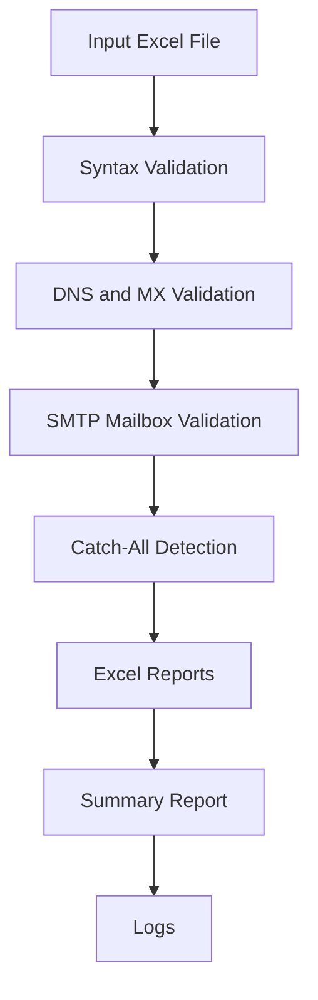

# Concurrent Email Validation System

A high-performance, concurrent, multi-stage email validation system built with Python. This project validates email addresses in bulk from Excel while preserving the original architecture exactly:

Input Excel -> Syntax Validation -> DNS/MX Validation -> SMTP Mailbox Validation -> Catch-All Detection -> Excel Reports -> Summary Report -> Logs

---

## Key Features

- Multi-stage validation pipeline with architecture preserved.
- Concurrent processing via ThreadPoolExecutor.
- Hybrid caching: in-memory LRU + persistent SQLite TTL cache.
- Syntax intelligence: RFC-aware checks, Unicode cleanup, reason codes.
- Domain intelligence: DNS/MX checks plus report metadata.
- SMTP intelligence: EHLO/HELO, STARTTLS attempt, feature capture, status interpretation.
- Catch-all classification with multi-probe strategy and domain-level cache.
- Rich reporting: enhanced Excel output, conditional formatting, summary worksheet, and plain-text summary report.
- Production-grade logs with thread context, stage timing, retries, and failure reason traces.

---

## Validation Pipeline Details



1. Stage 1: Syntax Validation (syntax_validator.py)
- Normalization (trim, lowercase, Unicode normalization).
- Control and invisible character checks.
- RFC-oriented validation via email-validator.
- Typo-domain suggestion detection.
- Role-account, free-provider, disposable classification.
- Duplicate and plus-addressing indicators.

2. Stage 2: DNS Validation (dns_checker.py)
- Fast fail path for invalid domains.
- MX lookup and domain existence verification.
- Additional DNS metadata collection for valid domains.
- DNS/MX cached responses with TTL.

3. Stage 3: SMTP Validation (smtp_validator.py)
- SMTP connection and RCPT probe (no mail sent).
- EHLO with HELO fallback.
- STARTTLS best effort.
- SMTP code mapping and explanation.
- Retry with exponential backoff and bounded runtime.
- SMTP response caching.

4. Stage 4: Catch-All Detection (catch_all_detector.py)
- Multiple randomized probes per domain.
- Classification states:
  DEFINITE_CATCH_ALL, LIKELY_CATCH_ALL, PARTIAL_CATCH_ALL, NOT_CATCH_ALL, UNKNOWN
- Cached per domain with TTL.

---

## Configuration (`config.py`)

All tuning parameters are centralized in config.py.

Important runtime controls:

- MAX_WORKERS
- DNS_TIMEOUT, DNS_RETRIES
- SMTP_TIMEOUT, SMTP_RETRIES, SMTP_TOTAL_TIMEOUT_SECONDS
- SMTP_MAX_MX_HOSTS
- CATCH_ALL_PROBE_COUNT, CATCH_ALL_RETRIES
- CACHE_DB_PATH and per-stage TTL values

Speed-first defaults are enabled now to prevent long hangs on poor DNS/SMTP infrastructure.

---

## Requirements & Installation

### Prerequisites

- Python 3.12+

### Installation

```bash
python -m pip install --upgrade pip
python -m pip install -r requirements.txt
```

---

## Usage

### 1) Validate an input Excel file

```bash
python main.py input/your_input_file.xlsx
```

### 2) Run the smoke input used during verification

```bash
python main.py input/Raw_Email_smoke.xlsx
```

### 3) Run tests

```bash
python -m pytest -q
```

### 4) Optional syntax compile check

```bash
python -m compileall .
```

---

## Output Files

All outputs are written to output/ and logs/.

1. output/validation_results.xlsx
- All records with enriched columns, including:
  Normalized Email, Domain, Provider, Role Account, Disposable, Free Provider,
  SMTP Code, SMTP Message, Catch-All Result, Risk Score, Confidence,
  Deliverability Score, Validation Time (ms), Reason Codes.
- Autofilter, frozen header row, auto-width columns, conditional formatting.
- Summary sheet included.

2. output/failed_emails.xlsx
- Failed/non-valid subset with same enhanced schema and summary sheet.

3. output/summary_report.txt
- Totals, status distribution, timing stats, top failing domains, provider distribution,
  deliverability distribution, and cache statistics.

4. logs/email_validator_YYYY-MM-DD.log
- Detailed execution logs with stage-level outcomes and diagnostics.

---

## Current Verification Status

Latest local verification completed successfully:

- Test suite: 8 passed.
- Smoke run: `python main.py input/Raw_Email_smoke.xlsx` completed successfully.
- Runtime improvement confirmed after performance tuning (from long wait to fast completion in current environment).

---

## Troubleshooting

- If runs are slow on your network, reduce MAX_WORKERS.
- If DNS is unstable, keep DNS_TIMEOUT low and DNS_RETRIES at 0 or 1 for fail-fast behavior.
- If SMTP is blocked (port 25 restrictions), expect TEMPORARY_FAILURE or ACCESS_DENIED classifications.
- If cache feels stale between repeated experiments, reduce TTL values in config.py.

---

## Limitations

- SMTP-level validation is provider-dependent and not universally deterministic.
- Catch-all detection is probabilistic by design.
- This system does not and cannot reliably prove user activity, mailbox ownership, or inbox usage state.
